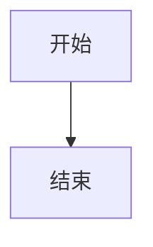

<center><h1>第X周作业</h1></center>
<h3 align="right">——2023210314，赵熠卓</h3>

## Question1

### (一).问题描述

Please Enter Your Content Here

### (二).数学模型

#### A.Subtitle1
##### (1).Chapter1
Content1

##### (2).Chapter2
Content

#### B.Subtitle2
##### (1).Chapter1
Content1

------------

Please Enter Your Content Here

Eg.正文插入公式$ \Omega $可以通过这种方式

单独列出公式$$ V_{disk}=\pi\ R^2h $$是这样的效果

------------

### (三).程序设计

#### A.流程图



#### B.代码

<center>question.m</center>

```matlab
% Enter Your Matlab Code Here %
```
### (四).计算结果与分析
```
Put Your Content Here.
```
